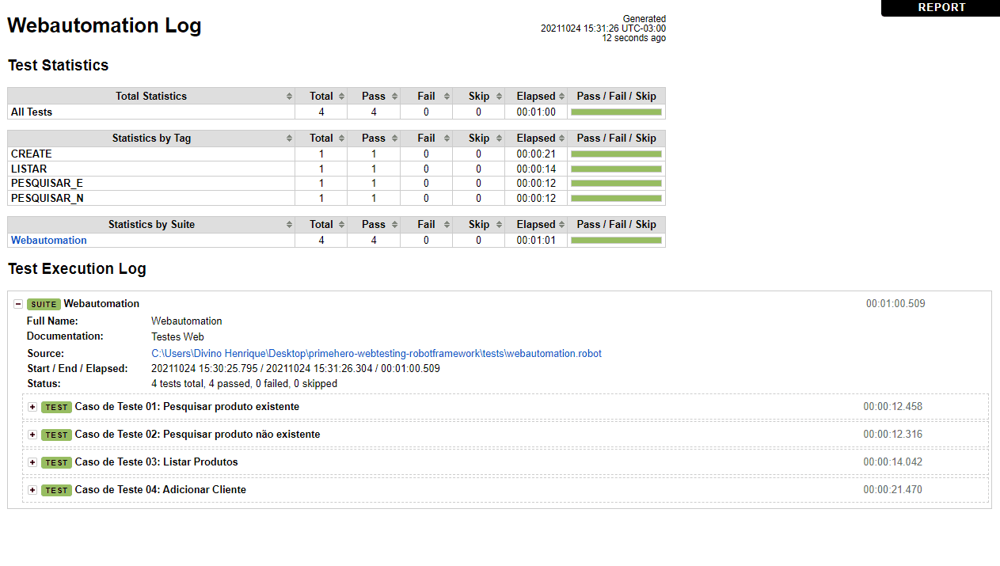

<h1 align="center">Robot Framework
</h1>

Validando casos de teste web utilizando 
<a href="https://robotframework.org/">Robot Framework</a> e 
<a href="https://github.com/robotframework/SeleniumLibrary/">SeleniumLibrary</a>.

 <a href="#pré-requisitos">Pré Requisitos</a> •
 <a href="#rodando-o-mobile">Casos de teste</a> •

### Pré-requisitos

Antes de começar, sera necessário ter instalado as ferramentas e tecnologias:
* [Python](https://www.python.org/)
* [Robot Framework](https://www.typescriptlang.org/)
~~~python3
pip install robotframework
~~~
* [SeleniumLibrary](https://reactnative.dev/)
~~~python3
pip install robotframework-seleniumlibrary
~~~
* [WebDriverManager](https://sites.google.com/a/chromium.org/chromedriver/home)
* [Visual Studio Code](https://openweathermap.org/api) ou [Pycharm](https://www.jetbrains.com/pt-br/pycharm/download/)

### Casos de teste

### Resultados

